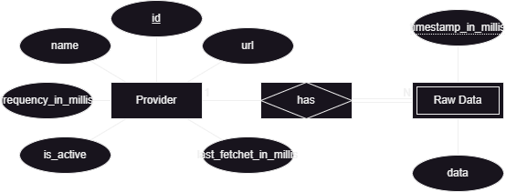

# Dynamic Fetching Scheduler — Back-End Documentation

## Table of Contents

- [Introduction](#introduction)
- [Modeling the Database](#modeling-the-database)
    - [Conceptual Model](#conceptual-model)
    - [Physical Model](#physical-model)
- [Application Architecture](#application-architecture)
  - [Controller Layer](#controller-layer)
  - [Service Layer](#service-layer)
  - [Repository Layer](#repository-layer)
  - [Data Representation](#data-representation)
- [Error Handling](#error-handling)
- [Running the application](#running-the-application)

## Introduction

The backend server is an API that provides the functionality for the Dynamic Fetching Scheduler.
It is written in Kotlin using a JVM gradle project.

The JVM application is a simple Spring Boot application, built with Spring Initializr.

To read more about the JVM application structure, see the [Application Architecture](#application-architecture) section.

The Dynamic Fetching Scheduler is a back-end service that allows users to schedule the retrieval of data from different 
providers. 
By adding a provider to the system, the service will make requests to the provider's endpoint to fetch the 
data with a given frequency, the data is then stored in the system and can be retrieved by the user.

## Modeling the Database

### Conceptual Model

The following diagram holds the Entity-Relationship model for the information managed by the system.



### Physical Model

The physical model of the database is available in [create-tables.sql](src/sql/create-tables.sql).

To implement and manage the database, PostgresSQL was used.

The [`code/sql`](src/sql) folder contains all SQL scripts developed:

- [create-tables.sql](src/sql/create-tables.sql) - Creates the database schema;
- [insert-test-data.sql](src/sql/insert-test-data.sql) - Erases the previous data and inserts a test double dataset for 
testing purposes;

## Application Architecture


The application is structured as follows:

- [/domain](/src/main/kotlin/dynamicFetchingScheduler/server/domain) - Contains the domain classes;
- [/http](/src/main/kotlin/dynamicFetchingScheduler/server/http) - Contains the controller layer of the application using Spring Web MVC;
- [/service](/src/main/kotlin/dynamicFetchingScheduler/server/service) - Contains the service layer of the application;
- [/repository](/src/main/kotlin/dynamicFetchingScheduler/server/repository) - Contains the data access layer of the application using JDBI;
- [/utils](/src/main/kotlin/dynamicFetchingScheduler/utils) - Contains the utility classes;

### Controller Layer

The controller layer is responsible for handling the HTTP requests, processing them and giving back a response; witch is
annotated with the `@RestController` and `@RequestMapping`. 
The methods are annotated with `@GetMapping`, `@PostMapping` and `@DeleteMapping` depending on the request method.
The responses are returned as a JSON object (Output Models),
and the requests are received as a JSON object (Input Models).

The Controller Layer is organized as follows:

- [controller](/src/main/kotlin/dynamicFetchingScheduler/server/http/controller) - Contains the controller class;
    - [models](/src/main/kotlin/dynamicFetchingScheduler/server/http/controller/models) - Contains the input and output models;

### Service Layer

The service layer is responsible for the business logic of the application. 
It is the intermediary between the controller and the repository layer.
It receives the requests from the controller layer, processes and sends them to the repository layer,
returning the response to the controller layer.
These responses can be one of two types:

- **Domain Objects**: If the operation only has one thing that can go wrong, we send to the controller the domain object or null;
- **Results**: If the operation can have multiple things that can go wrong, we send to the controller a result object.

Each service class is responsible for a specific domain of the application, and it's annotated with `@Service`.

The Service layer is organized as follows:

- [errors](/src/main/kotlin/dynamicFetchingScheduler/server/service/errors) - Contains the error classes;
- [ProviderService](/src/main/kotlin/dynamicFetchingScheduler/server/service/ProviderService.kt) - Contains the business logic for the provider;
- [ProviderSchedulerService](/src/main/kotlin/dynamicFetchingScheduler/server/service/ProviderSchedulerService.kt) - Contains the business logic for the scheduling of the retrieval of data from a provider;
- [FetchDataService](/src/main/kotlin/dynamicFetchingScheduler/server/service/FetchDataService.kt) - Contains the business logic for the retrieval of data from a provider;
- [ProviderResults](/src/main/kotlin/dynamicFetchingScheduler/server/service/ProviderResults.kt) - Contains the result objects for the provider operations;

### Repository Layer

The repository layer is responsible for the data access of the application,
receiving the requests from the service layer, 
processing them and sending them to the database, returning the response to the service layer.
The data is represented used in this layer is the domain model itself.

This layer is designed to use a [JDBI interface](https://jdbi.org/) to access the database,
but it can be easily changed to use another database access library.

This layer is organized as follows:

- [jdbi](/src/main/kotlin/dynamicFetchingScheduler/server/repository/jdbi) -
  Contains the implementation of the transaction and transaction manager for JDBI with the mappers
  needed to convert the objects retried from the database to the domain model;
- [provider](/src/main/kotlin/dynamicFetchingScheduler/server/repository/provider) - Contains the repository for the provider;
- [rawData](/src/main/kotlin/dynamicFetchingScheduler/server/repository/rawData) - Contains the repository for the raw data;

### Data Representation

- **Domain Model**: The domain model is the representation of the data in the application.
  It is used across all layers of the application.
- **Input/Output Models**: The input and output models are the representation of the data received and sent in the requests.
  They are used exclusively in the controller layer.

## Error Handling

No error handling was implemented in the controller layer, 
as the Spring Boot framework handles the exceptions and returns a Bad Request response.

## Running the application

To run the application, you need to have the following installed:

- [Gradle](https://gradle.org/)
- [Java 17](https://www.oracle.com/java/technologies/javase-jdk17-downloads.html)
- [Docker](https://www.docker.com/)

With the Gradle wrapper, you can build the application with the following command on the [jvm folder](./../jvm):

```shell
./gradlew build
```

Alternatively, it's possible to deploy the application using Docker, with the following steps:

```shell
  docker compose up -d --build --force-recreate
```
